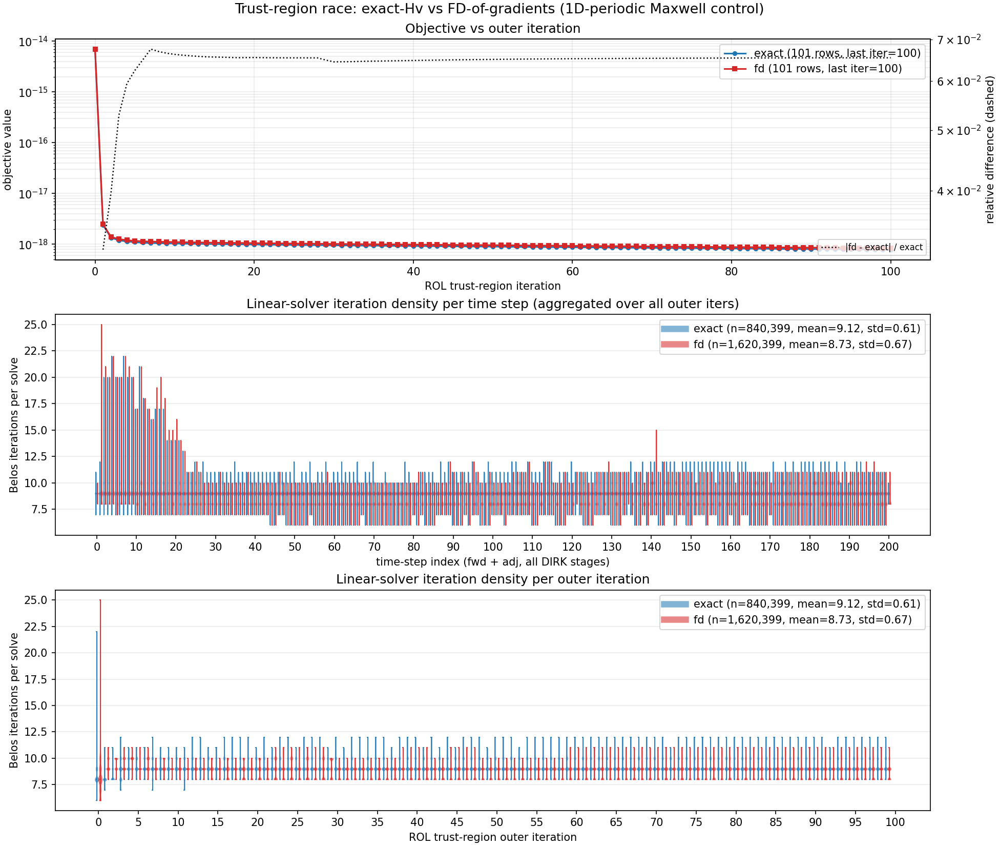

# 1D-periodic Maxwell control: exact-Hv vs FD-of-gradients

Timed ROL trust-region Newton-CG runs on the same LQ Maxwell control problem.
The only difference between the two runs is how Hessian-vector products are
computed:

- **exact**: uses [Heinkenschloss Alg 4.1](https://repository.rice.edu/bitstreams/ccc225f5-d89c-4b43-81f4-983f7cfe5dd0/download)
  (1 tangent + 1 second-order adjoint = 2 sweeps per hessVec).
  - No step size; applies the same symmetric operator every time.
- **fd**: uses finite-difference of gradients
  (`[grad(u + h*v) - grad(u)] / h`, ~2 gradients per hessVec).
  - Cost: 2 gradient evaluations, each = 1 forward + 1 adjoint = 4 sweeps.
    Noise floor ~eps/h; CG degrades in the small-gradient endgame where noise
    stops being small relative to signal.


## Headline numbers (from `logs/{exact,fd}_time.log`, 22 MPI ranks combined)

| Quantity                     | exact     | fd         | ratio  |
|------------------------------|-----------|------------|--------|
| Outer TR iterations          | 100       | 100        | -      |
| Final `value`                | 7.82e-19  | 8.33e-19   | ~1     |
| Final `gnorm`                | 6.59e-17  | 7.02e-17   | ~1     |
| `Objective::hessVec()` calls | 2000      | 0 (*)      | -      |
| `Objective::gradient()` calls| 101       | 4101       | 40.6x  |
| `SolverManager::forward()`   | 2101      | 4001       | 1.90x  |
| `SolverManager::adjoint()`   | 2101      | 4101       | 1.95x  |
| Total sweeps                 | 4202      | 8102       | 1.93x  |
| Belos BiCGStab solves        | 8.40e5    | 1.62e6     | 1.93x  |
| Wall clock                   | 4461 s    | 7257 s     | 1.63x  |


## Diagnostics figure



Produced by `analyze_tr.py` from `logs/mrhyde_r1_{exact,fd}.log`:

```
python analyze_tr.py logs/mrhyde_r1_exact.log logs/mrhyde_r1_fd.log --cache-dir logs/cache
```

Full logs not commited on the account of being 700Mb-1GB in size.
