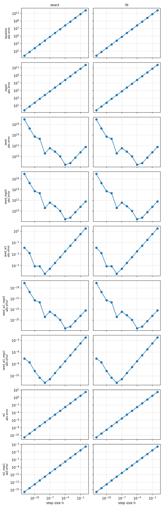
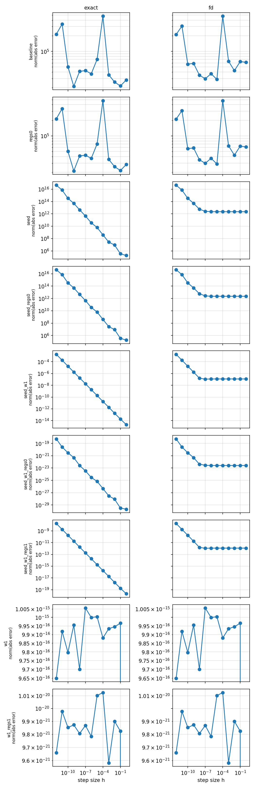

# FD gradient and Hessian-vector checks (LQ)

Sandbox check of the FD gradient and exact HessVec `H v` for a
quadratic-in-state Maxwell control problem
(`0.5*eps*|E|^2 + 0.5/mu*|B|^2`). The reduced problem is
linear-quadratic, so `H(x)` is constant and
`grad(x+v) - grad(x) = H v` holds exactly.

## Run

```bash
./run_exact_sweep.sh   # 9 configs with    src_gate (exact tangent+adjoint HessVec)
./run_fd_sweep.sh      # 9 configs without src_gate (ROL FD-of-gradients HessVec)
python plot_hess_vec_check.py
```

Both ROL decks under `rol_decks/` set:

```yaml
Do grad+hessvec check: true    # checkGradient + checkHessVec + checkHessSym
Do secant identity check: true # Hv vs (grad(x+v) - grad(x))
FD Check Seed: 3               # random direction dir for (J(x+h*dir)-J(x))/h
```

Modes named `seed*` use `rol_seed_hess.yaml`, which also sets:

```yaml
FD Check Random Seed: 42       # replace iterate x with a random vector (FD check only)
FD Check Random Scale: 1.0
```

The other four modes use `rol_noscale_hess.yaml` (probe at optimizer iterate).

### Exact vs FD HessVec

Exact HessVec needs a tangent sweep with the physical source off.
`other_decks_exact/` wraps the current with an inactive scalar:

```yaml
current x: 'src_gate*(gt*exp(-2*timebub*(t<toff))*(z<zmax)*(z>zmin))'
```

`incrementalForwardModel` sets `src_gate` to 0 for the tangent, then back to 1.
`other_decks_fd/` omits the wrapper, so `Objective_MILO::hessVec` falls back
to `ROL::Objective::hessVec` (FD-of-gradients).

## FD gradient results

Path-independent: same numbers in exact and fd logs.

| Param config  | w_EM  | w_reg | Probe    | grad'*dir  | best abs_err @ h    | rel_err   |
|---------------|-------|-------|----------|------------|---------------------|-----------|
| baseline      | 1e35  | 1e5   | iterate  | +3.10e-02  | 6.40e-01 @ 1e-12    | 2.1e+01   |
| regs0         | 1e35  | 0     | iterate  | +3.10e-02  | 6.40e-01 @ 1e-12    | 2.1e+01   |
| w1            | 1     | 1e5   | iterate  | +3.10e-37  | 3.09e-11 @ 1e-12    | 1.0e+26   |
| w1_regs1      | 1     | 1     | iterate  | +3.10e-37  | 3.09e-16 @ 1e-12    | 1.0e+21   |
| seed          | 1e35  | 1e5   | random   | +6.69e+11  | 3.04e+08 @ 1e-04    | 4.5e-04   |
| seed_regs0    | 1e35  | 0     | random   | +6.69e+11  | 3.04e+08 @ 1e-04    | 4.5e-04   |
| seed_w1       | 1     | 1e5   | random   | +2.69e-01  | 3.95e-07 @ 1e-08    | 1.5e-06   |
| seed_w1_regs1 | 1     | 1     | random   | +2.69e-06  | 7.07e-12 @ 1e-08    | 2.6e-06   |
| seed_w1_regs0 | 1     | 0     | random   | +6.69e-24  | 3.04e-27 @ 1e-04    | 4.5e-04   |

Probe:

- **iterate** (`rol_noscale_hess.yaml`):
  - `ctrl_current` starts at 0, so fields collapse, EM path vanishes, `grad'*dir` at the noise floor.
- **random** (`rol_seed_hess.yaml`):
  - random `x` for the FD check only (fixed seeds).




## HessVec results: exact (e) vs FD (f)

| Param config      | Path | w_EM | w_curlreg | \|hsym\|   | \|secant\|/ref | \|hv0\| | \|bilin\|/ref | <v,Hv>_min |
|-------------------|------|-----:|----------:|-----------:|---------------:|--------:|--------------:|-----------:|
| baseline          | e    | 1e35 | 1e5       | 2.99e+04   | 3.83e-08       | 0       | 7.24e-08      | 9.42e+11   |
| **baseline**      | f    | 1e35 | 1e5       | 8.79e+03   | 1.35e-05       | 0       | 6.89e-05      | 9.42e+11   |
| regs0             | e    | 1e35 | 0         | 2.99e+04   | 3.83e-08       | 0       | 7.24e-08      | 9.42e+11   |
| **regs0**         | f    | 1e35 | 0         | 8.79e+03   | 1.35e-05       | 0       | 6.89e-05      | 9.42e+11   |
| seed              | e    | 1e35 | 1e5       | 1.41e+04   | 3.83e-08       | 0       | 1.16e-07      | 8.09e+11   |
| **seed**          | f    | 1e35 | 1e5       | 7.81e+03   | 1.35e-05       | 0       | 8.56e-05      | 8.09e+11   |
| seed_regs0        | e    | 1e35 | 0         | 1.41e+04   | 3.83e-08       | 0       | 1.16e-07      | 8.09e+11   |
| **seed_regs0**    | f    | 1e35 | 0         | 7.81e+03   | 1.35e-05       | 0       | 8.56e-05      | 8.09e+11   |
| seed_w1           | e    | 1    | 1e5       | 2.22e-16   | 0              | 0       | 2.92e-16      | 6.11e+01   |
| **seed_w1**       | f    | 1    | 1e5       | 2.22e-16   | 2.80e-16       | 0       | 3.27e-16      | 6.11e+01   |
| seed_w1_regs0     | e    | 1    | 0         | 7.68e-32   | 3.73e-08       | 0       | 1.23e-07      | 8.09e-24   |
| **seed_w1_regs0** | f    | 1    | 0         | 1.06e-31   | 2.73e-05       | 0       | 7.37e-05      | 8.09e-24   |
| seed_w1_regs1     | e    | 1    | 1         | 3.81e-21   | 0              | 0       | 3.01e-16      | 6.11e-04   |
| **seed_w1_regs1** | f    | 1    | 1         | 3.81e-21   | 2.84e-16       | 0       | 3.20e-16      | 6.11e-04   |
| w1                | e    | 1    | 1e5       | 1.67e-16   | 0              | 0       | 3.02e-16      | 5.85e+01   |
| **w1**            | f    | 1    | 1e5       | 1.67e-16   | 2.80e-16       | 0       | 3.31e-16      | 5.85e+01   |
| w1_regs1          | e    | 1    | 1         | 1.29e-20   | 0              | 0       | 2.98e-16      | 5.85e+01   |
| **w1_regs1**      | f    | 1    | 1         | 1.29e-20   | 2.84e-16       | 0       | 3.31e-16      | 5.85e+01   |

### Columns

- `|hsym|` -- asymmetry `|<v1,Hv2> - <v2,Hv1>|`. Noise floor tracks the
  dominant weight (~1e4 at w_EM=1e35, ~1e-16 at unit w_EM with analytic
  reg, ~1e-31 for pure state path at unit weights).
- `|secant|/ref` -- `|Hv - (grad(x+v)-grad(x))| / |grad(x+v)-grad(x)|`.
  On LQ this is a true operator check. Exact: machine/solver noise.
  Non-noise nonzero is a bug.
- `|hv0|` -- `||H*0||`. Sanity check - must be 0 (passes everywhere).
- `|bilin|/ref` -- relative linearity residual. ~1e-7 (state-adjoint),
  ~1e-16 (analytic-reg).
- `<v,Hv>_min` -- min Rayleigh over two random directions. Positive
  (LQ is convex). Magnitude tracks w_EM vs w_curlreg: at unit w_EM,
  w_curlreg=1e5 jumps `<v,Hv>` from 8.09e-24 to 6.11e+01.

### Exact vs FD on LQ

Both paths recover the same operator; differences are noise floor only.
The FD penalty shows up only where the misfit/state path dominates.

| Metric | Exact | FD |
|--------|-------|-----|
| `|secant|/ref` | ~4e-8 (or 0 when reg dominates) | ~3e-5 (amplified solver noise; or ~3e-16 when reg dominates) |
| `|bilin|/ref` | ~1e-7 (state) / ~1e-16 (reg) | ~1e-5 (or ~3e-16 when reg dominates) |
| `|hsym|`, `<v,Hv>_min` | similar | similar (probe error cancels) |



